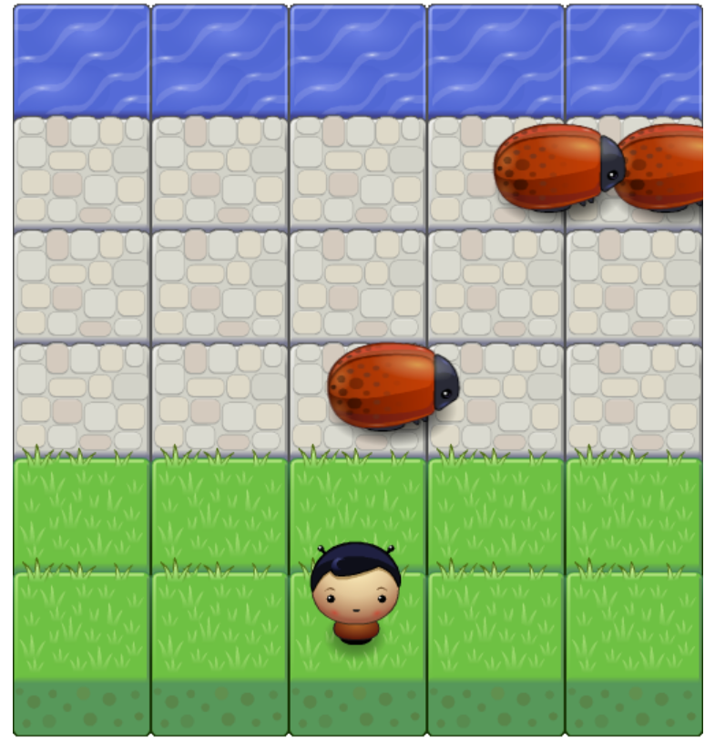

# Classic Arcade Game Clone

## Project Overview

Project 3 of Udacity's Front-End Web Developer Nanodegree. The task was to recreate the classic arcade game Frogger with provided visual assets and a game loop engine by adding a number of entities to the game including player characters, enemies and collectable items.

## Live overview
https://worm4047.github.io/Arcade/

## Getting Started

Local

1. Clone this repo

	$ git clone https://github.com/Worm4047/Arcade

2. Serve the application

	$ python -m SimpleHTTPServer

3. Open the application

	$ open "http://localhost:8000"

4. Or simply, open the index.html file :p

## Instructions to play the game

1. The game is to be played using arrow keys, i.e up, down, left and right.
2. Any collision would set the score to 0 and reset the game.
3. On reaching the river, the player gets 40 points and starts again.
4. Once you reach 200 points you win the game.
